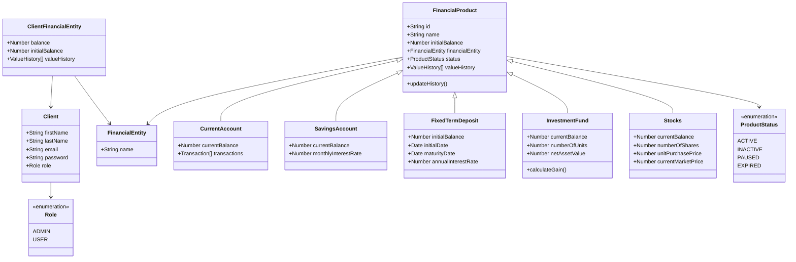

# Documento de Diseño Técnico - API de Gestión de Activos Financieros

## 1. Introducción

Este documento describe la arquitectura y el diseño técnico para una API RESTful destinada a la gestión de un portfolio de productos financieros. El objetivo es definir una estructura de datos escalable, endpoints claros y la lógica de negocio principal para cumplir con los requisitos del proyecto.

## 2. Modelo de Datos

Se propone una arquitectura basada en una entidad base `ProductoFinanciero` que agrupa los atributos comunes, y entidades específicas que heredan de esta y añaden sus propios campos.

### Enumeraciones

**ProductType**: Define los posibles productos.

- `CURRENT_ACCOUNT`
- `SAVINGS_ACCOUNT`
- `FIXED_TERM_DEPOSIT`
- `INVESTMENT_FUND`
- `STOCKS`

**ProductStatus**: Define los posibles estados de cualquier producto.

- `ACTIVE`
- `INACTIVE`
- `PAUSED`
- `EXPIRED`

**Role**: Define los roles de usuario para el control de acceso.

- `ADMIN`
- `USER`

### Entidad de Usuario

**Client**

- `id` (UUID): Identificador único del cliente.
- `firstName` (String): Nombre.
- `lastName` (String): Apellidos.
- `nickname` (String): Apodo.
- `email` (String): Correo electrónico (Único).
- `password` (String): Hash de la contraseña.
- `role` (Role): Rol del usuario (`ADMIN` o `USER`).
- `createdAt` / `updatedAt`: Fechas de auditoría.

**FinancialEntity**

- `id` (UUID): Identificador único (Catálogo).
- `name` (String): Nombre de la entidad (e.g., "Banco Santander").

**ClientFinancialEntity** (Vinculación)

- `id` (UUID): Identificador único de la relación.
- `clientId` (UUID): Cliente.
- `financialEntityId` (UUID): Entidad del catálogo.
- `balance` (Number): Valor total del patrimonio en esta entidad.
- `initialBalance` (Number): Valor inicial al crear la relación.
- `valueHistory` (Array): Histórico de valoraciones.
  - `date` (Date)
  - `value` (Number)
  - `previousValue` (Number): Valor anterior.

### Entidad Base

**FinancialProduct**

- `id` (String): Identificador único formado por `PREFIJO-UUID` (e.g., `CUR-550e8400...`).
- `type` (ProductType): Tipo de producto.
- `name` (String): Nombre descriptivo del producto (e.g., "Cuenta Nómina Premium").
- `financialEntityId` (UUID): Referencia a la entidad financiera.
- `status` (ProductStatus): Estado actual del producto.
- `initialBalance` (Number): Saldo inicial (opcional).
- `clientId` (UUID): Identificador del cliente propietario.
- `valueHistory` (Array): Histórico de valoraciones para trazabilidad.
  - `date` (Date)
  - `value` (Number)
  - `previousValue` (Number)

### Entidades Específicas

**CurrentAccount** (hereda de `FinancialProduct`)

- `currentBalance` (Number): Saldo monetario actual.
- `transactions` (Array): Historial de transacciones.
  - `date` (Date)
  - `description` (String)
  - `amount` (Number)

**SavingsAccount** (hereda de `FinancialProduct`)

- `currentBalance` (Number): Saldo monetario actual.
- `monthlyInterestRate` (Number): Porcentaje de interés (e.g., 0.01 para 1%).

**FixedTermDeposit** (hereda de `FinancialProduct`)
- `currentBalance` (Number): Valor actual del depósito (permite seguimiento de valoración).
- `initialDate` (Date): Fecha de inicio del depósito.
- `maturityDate` (Date): Fecha de finalización del depósito.
- `annualInterestRate` (Number): Tasa de interés nominal anual (e.g., 0.05 para 5%).
- `interestPaymentFrequency` (String): "Monthly", "Quarterly", "Annual", "AtMaturity".

**InvestmentFund** (hereda de `FinancialProduct`)

- `currentBalance` (Number): Valor actual del fondo.
- `numberOfUnits` (Number): Cantidad de participaciones del cliente.
- `netAssetValue` (Number): Valor actual de una participación.Valor liquidativo

- `fees` (Object):
  - `opening` (Number) Coste de apertura o supscripcion
  - `closing` (Number) coste de reembolso
  - `maintenance` (Number) coste de mantenimiento o gestion
  - `custody` (Number) coste de deposito

**Stocks** (hereda de `FinancialProduct`)

- `initialBalance` (Number): Inversión inicial (Obligatorio en creación).
- `currentBalance` (Number): Valor total de mercado.
- `numberOfShares` (Number): Cantidad de acciones.
- `unitPurchasePrice` (Number): Precio medio de compra por acción.
- `currentMarketPrice` (Number): Precio actual de mercado por acción.
- `fees` (Object):
  - `buying` (Number)
  - `selling` (Number)

> **Nota de Validación**: La API implementa una validación estricta por tipo. Solo se permite enviar y recibir los campos definidos para cada tipo de producto específico. Intentar actualizar un campo ajeno al tipo (ej. `monthlyInterestRate` en `STOCKS`) provocará un error `400 Bad Request`.

### Estructura JSON de Peticiones (Ejemplos)

A continuación se detallan los esquemas JSON esperados en el cuerpo de las peticiones `POST` y `PUT` para la gestión de productos.Se utiliza un código en el campo `type` para referenciar el tipo de producto.

**Cuenta Corriente**

```json
{
  "type": "CURRENT_ACCOUNT",
  "name": "Premium Payroll Account",
  "financialEntity": "ca1c82a9-e536-46c8-9e26-e08b7ed20652",
  "status": "ACTIVE",
  "clientId": "550e8400-e29b-41d4-a716-446655440000",
  "currentBalance": 2500.5
}
```

**Cuenta Remunerada**

```json
{
  "type": "SAVINGS_ACCOUNT",
  "name": "Savings Plus Account",
  "financialEntity": "ca1c82a9-e536-46c8-9e26-e08b7ed20652",
  "status": "ACTIVE",
  "currentBalance": 10000.0,
  "monthlyInterestRate": 0.02
}
```

**Depósito a Plazo Fijo**

```json
{
  "type": "FIXED_TERM_DEPOSIT",
  "name": "Depósito 12 Meses",
  "financialEntity": "ca1c82a9-e536-46c8-9e26-e08b7ed20652",
  "status": "ACTIVE",
  "initialBalance": 5000.0,
  "currentBalance": 5000.0, // Actualizable para seguimiento de valoración
  "initialDate": "2024-01-01T00:00:00Z",
  "maturityDate": "2024-12-31T23:59:59Z",
  "annualInterestRate": 0.035,
  "interestPaymentFrequency": "Quarterly"
}
```

**Fondo de Inversión**

```json
{
  "type": "INVESTMENT_FUND",
  "name": "Fondo Tecnológico Global",
  "financialEntity": "ca1c82a9-e536-46c8-9e26-e08b7ed20652",
  "status": "ACTIVE",
  "currentBalance": 32000.0,
  "numberOfUnits": 150.5,
  "netAssetValue": 210.45,
  "fees": {
    "opening": 15.0,
    "closing": 15.0,
    "maintenance": 10.0
  }
}
```

**Acciones**

```json
{
  "type": "STOCKS",
  "name": "Acciones Apple Inc.",
  "financialEntity": "ca1c82a9-e536-46c8-9e26-e08b7ed20652",
  "status": "ACTIVE",
  "currentBalance": 4455.0,
  "initialBalance": 3625.0,
  "numberOfShares": 25,
  "unitPurchasePrice": 145.0,
  "currentMarketPrice": 178.2,
  "fees": {
    "buying": 5.0,
    "selling": 5.0
  }
}
```

## 3. Propuesta de Arquitectura de API (RESTful)

La API seguirá los principios REST, utilizando sustantivos en plural para las colecciones y los verbos HTTP estándar.

### Endpoints Principales

> **Nota de Seguridad**: Todos los endpoints (excepto `/auth/*` y `/health`) requieren un token JWT válido en la cabecera `Authorization: Bearer <token>`.

- **`POST /auth/register`**: Registra un nuevo usuario con rol `USER`.
  - **Body**: `{ "email": "...", "password": "...", "firstName": "...", "lastName": "..." }`
  - **Respuestas**: `201 Created`, `400 Bad Request`, `409 Conflict`.

- **`POST /auth/login`**: Autentica un usuario y devuelve un token JWT.
  - **Body**: `{ "email": "...", "password": "..." }`
  - **Respuestas**: `200 OK` (con token), `401 Unauthorized`.

- **`GET /clients`**: Obtiene una lista de todos los clientes registrados (Solo ADMIN).
  - **Respuestas**:
    - `200 OK`: Lista de clientes.
    - `403 Forbidden`: Acceso denegado.
    - **Ejemplo de Respuesta**:
      ```json
      [
        {
          "id": "550e8400-e29b-41d4-a716-446655440000",
          "firstName": "Juan",
          "lastName": "Pérez",
          "nickname": "juanperez",
          "email": "juan.perez@example.com",
          "role": "USER"
        }
      ]
      ```

- **`PUT /clients/{id}`**: Actualiza la información básica del perfil del cliente.
  - **Seguridad**: Solo el propio usuario autenticado puede actualizar sus datos (`token.sub === id`).
  - **Body**: `{ "firstName": "...", "lastName": "...", "nickname": "..." }`
  - **Respuestas**:
    - `200 OK`: Cliente actualizado correctamente.
    - `400 Bad Request`: Datos inválidos.
    - `403 Forbidden`: Intento de modificar un perfil ajeno.
    - `404 Not Found`: Cliente no encontrado.

- **`GET /products`**: Obtiene una lista de todos los productos financieros.
  - **Filtros (Query Params)**:
    - `?status=ACTIVE`
    - `?financialEntity=Central Bank`
    - `?type=INVESTMENT_FUND` (para filtrar por tipo de producto)
  - **Respuestas**:
    - `200 OK`: Lista obtenida correctamente.
    - `400 Bad Request`: Error en los parámetros de filtro.

- **`POST /products`**: Crea un nuevo producto financiero. El `body` de la petición determinará el tipo de producto a crear.
  - **Respuestas**:
    - `201 Created`: Producto creado exitosamente.
    - `400 Bad Request`: Datos de entrada inválidos.

- **`GET /products/{id}`**: Obtiene los detalles de un producto financiero específico.
  - **Respuestas**:
    - `200 OK`: Detalle del producto.
    - `404 Not Found`: Producto no encontrado.

- **`PUT /products/{id}`**: Actualiza la información de un producto financiero.
  - **Respuestas**:
    - `204 No Content`: Producto actualizado correctamente.
    - `400 Bad Request`: Datos inválidos.
    - `404 Not Found`: Producto no encontrado.

- **`PATCH /products/{id}`**: Actualiza parcialmente un producto, utilizado específicamente para cambios de estado.
  - **Body**: `{ "status": "PAUSED" }`
  - **Respuestas**:
    - `204 No Content`: Estado actualizado correctamente.
    - `400 Bad Request`: Transición de estado no permitida.
    - `404 Not Found`: Producto no encontrado.

- **`DELETE /products/{id}`**: Elimina un producto (o lo marca como `Inactivo`).
  - **Respuestas**:
    - `204 No Content`: Producto eliminado.
    - `404 Not Found`: Producto no encontrado.

- **`POST /products/{id}/transactions`**: Agrega una nueva transacción a un producto (Solo Cuentas Corrientes y de Ahorro).
  - **Body**:
    ```json
    { "description": "Salary", "date": "2023-10-27T10:00:00Z", "amount": 1500.00 }
    ```
  - **Respuestas**:
    - `201 Created`: Transacción creada y saldo actualizado.
    - `400 Bad Request`: Tipo de producto inválido o datos incorrectos.
    - `404 Not Found`: Producto no encontrado.

### Endpoints de Entidades Financieras

- **`GET /financial-entities`**: Obtiene una lista de entidades financieras.
  - **Filtros (Query Params)**:
    - `?clientId={uuid}`
    - `?name={string}`
  - **Respuestas**:
    - `200 OK`: Lista obtenida correctamente.

- **`POST /financial-entities`**: Crea una nueva entidad financiera.
  - **Respuestas**:
    - `201 Created`: Entidad creada exitosamente.
    - `500 Internal Server Error`: Error del servidor.

- **`GET /financial-entities/{id}`**: Obtiene los detalles de una entidad financiera.
  - **Respuestas**:
    - `200 OK`: Detalle de la entidad.
    - `404 Not Found`: Entidad no encontrada.

- **`PUT /financial-entities/{id}`** y **`PATCH /financial-entities/{id}`**: Actualiza la información de una entidad financiera.
  - **Respuestas**:
    - `204 No Content`: Entidad actualizada correctamente.
    - `404 Not Found`: Entidad no encontrada.

- **`DELETE /financial-entities/{id}`**: Elimina una entidad financiera.
  - **Respuestas**:
    - `204 No Content`: Entidad eliminada.
    - `404 Not Found`: Entidad no encontrada.

### Endpoints de Vinculación (Cliente-Entidad)

- **`GET /clients/financial-entities`**: Obtiene todas las asociaciones del sistema (Solo ADMIN).
  - **Respuestas**:
    - `200 OK`: Lista completa con datos del cliente.
    - `403 Forbidden`: Acceso denegado.

- **`POST /clients/{clientId}/financial-entities`**: Crea una asociación entre un cliente y una entidad financiera del catálogo.
- **`GET /clients/{clientId}/financial-entities`**: Obtiene las asociaciones de un cliente.
- **`GET /clients/{clientId}/financial-entities/{id}`**: Obtiene el detalle de una asociación.
- **`PUT /clients/{clientId}/financial-entities/{id}`**: Actualiza el saldo de la asociación.
  - **Body**: `{ "balance": 15000.00 }`
  - **Respuestas**:
    - `204 No Content`: Saldo actualizado (genera histórico).
    - `404 Not Found`: Asociación no encontrada.

### Endpoints de Lógica de Negocio

- **`GET /products/{id}/history`**: Obtiene el histórico de valoraciones de un producto.
  - **Respuestas**:
    - `200 OK`: Histórico obtenido.
    - `404 Not Found`: Producto no encontrado.

- **`POST /investment-funds/{id}/redeem`**: Inicia el proceso de rescate de un fondo de inversión.
  - **Body**: `{ "units": 100 }`
  - **Respuesta**: Devuelve el importe bruto, la retención calculada y el importe neto.
  - **Respuestas**:
    - `200 OK`: Operación exitosa.
    - `400 Bad Request`: Saldo insuficiente o error de validación.

- **`POST /stocks/{id}/sell`**: Vende un número determinado de acciones.
  - **Body**: `{ "shares": 50, "sellingPrice": 125.50 }`
  - **Respuestas**:
    - `200 OK`: Venta realizada.
    - `400 Bad Request`: Número de acciones insuficiente.

## 4. Lógica de Negocio

### Actualización del Histórico de Valor

Cualquier operación que modifique el valor principal de un producto (un movimiento en cuenta corriente, una actualización del valor liquidativo, etc.) deberá generar una nueva entrada en el array `valueHistory` del producto correspondiente. Esta lógica se encapsulará en los servicios de cada producto.

### Motor de Cálculo Fiscal (Retenciones)

Esta lógica se aplicará principalmente en el servicio asociado al endpoint `POST /investment-funds/{id}/redeem`.

1.  **Calcular Plusvalía**:
    - Se calcula el valor de compra proporcional a las participaciones rescatadas.
    - `ValorVenta = participaciones_a_rescatar * valorLiquidativoActual`
    - `ValorCompra = participaciones_a_rescatar * (valorCompraTotal / numeroParticipacionesTotal)`
    - `Plusvalia = ValorVenta - ValorCompra`

2.  **Aplicar Tramos de Retención**:
    - Si `Plusvalia <= 0`, la retención es 0.
    - Si `0 < Plusvalia <= 6000`:
      - `Retencion = Plusvalia * 0.19`
    - Si `Plusvalia > 6000`:
      - `Retencion = (6000 * 0.19) + ((Plusvalia - 6000) * 0.21)`

3.  **Resultado**: El servicio devolverá el importe neto final al usuario tras deducir comisiones y la retención calculada.

## 5. Gestión de Errores

Se definen los siguientes códigos de error para estandarizar las respuestas de fallo (400/404/500).

**Estructura de Error:**

```json
{
  "code": "ERR_INSUFFICIENT_FUNDS",
  "message": "El saldo disponible no es suficiente para realizar la operación."
}
```

**Códigos Definidos:**
| Código | HTTP Status | Descripción |
| :--- | :--- | :--- |
| `ERR_VALIDATION` | 400 | Error en la validación de campos. |
| `ERR_NOT_FOUND` | 404 | Recurso no encontrado. |
| `ERR_INSUFFICIENT_FUNDS` | 400 | Saldo o participaciones insuficientes. |
| `ERR_INVALID_STATE` | 400 | Operación no permitida en el estado actual del producto. |

## 6. Diagrama de Clases (Mermaid)


