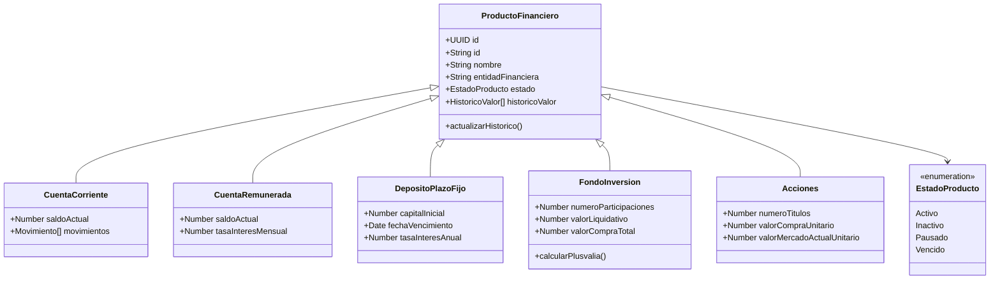

# Documento de Diseño Técnico - API de Gestión de Activos Financieros

## 1. Introducción

Este documento describe la arquitectura y el diseño técnico para una API RESTful destinada a la gestión de un portfolio de productos financieros. El objetivo es definir una estructura de datos escalable, endpoints claros y la lógica de negocio principal para cumplir con los requisitos del proyecto.

## 2. Modelo de Datos

Se propone una arquitectura basada en una entidad base `ProductoFinanciero` que agrupa los atributos comunes, y entidades específicas que heredan de esta y añaden sus propios campos.

### Enumeraciones

**ProductStatus**: Define los posibles estados de cualquier producto.
- `ACTIVE`
- `INACTIVE`
- `PAUSED`
- `EXPIRED`

**Role**: Define los roles de usuario para el control de acceso.
- `ADMIN`
- `USER`

### Entidad de Usuario

**Client**
- `id` (UUID): Identificador único del cliente.
- `username` (String): Nombre de usuario.
- `role` (Role): Rol del usuario (ADMIN o USER).

### Entidad Base

**FinancialProduct**
- `id` (String): Identificador único formado por `PREFIJO-UUID` (e.g., `CUR-550e8400...`).
- `name` (String): Nombre descriptivo del producto (e.g., "Cuenta Nómina Premium").
- `financialEntity` (String): Nombre de la entidad (e.g., "Banco Central").
- `status` (ProductStatus): Estado actual del producto.
- `clientId` (UUID): Identificador del cliente propietario.
- `valueHistory` (Array<Object>): Histórico de valoraciones para trazabilidad.
  - `date` (Date)
  
  - `value` (Number)

### Entidades Específicas

**CurrentAccount** (hereda de `FinancialProduct`)
- `currentBalance` (Number): Saldo monetario actual.
- `transactions` (Array<Object>): Historial de transacciones.
  - `date` (Date)
  - `description` (String)
  - `amount` (Number)

**SavingsAccount** (hereda de `FinancialProduct`)
- `currentBalance` (Number): Saldo monetario actual.
- `monthlyInterestRate` (Number): Porcentaje de interés (e.g., 0.01 para 1%).

**FixedTermDeposit** (hereda de `FinancialProduct`)
- `initialCapital` (Number): Importe inicial del depósito.
- `maturityDate` (Date): Fecha de finalización del depósito.
- `annualInterestRate` (Number): Tasa de interés nominal anual (e.g., 0.05 para 5%).
- `interestPaymentFrequency` (String): "Monthly", "Quarterly", "Annual", "AtMaturity".

**InvestmentFund** (hereda de `FinancialProduct`)
- `numberOfUnits` (Number): Cantidad de participaciones del cliente.
- `netAssetValue` (Number): Valor actual de una participación.
- `totalPurchaseValue` (Number): Coste total de adquisición de las participaciones.
- `fees` (Object):
  - `opening` (Number)
  - `closing` (Number)
  - `maintenance` (Number)

**Stocks** (hereda de `FinancialProduct`)
- `numberOfShares` (Number): Cantidad de acciones.
- `unitPurchasePrice` (Number): Precio medio de compra por acción.
- `currentMarketPrice` (Number): Precio actual de mercado por acción.
- `fees` (Object):
  - `buying` (Number)
  - `selling` (Number)

### Estructura JSON de Peticiones (Ejemplos)

A continuación se detallan los esquemas JSON esperados en el cuerpo de las peticiones `POST` y `PUT` para la gestión de productos.Se utiliza un código en el campo `type` para referenciar el tipo de producto.

**Cuenta Corriente**
```json
{
  "type": "CURRENT_ACCOUNT",
  "name": "Premium Payroll Account",
  "financialEntity": "Central Bank",
  "status": "ACTIVE",
  "clientId": "550e8400-e29b-41d4-a716-446655440000",
  "currentBalance": 2500.50
}
```

**Cuenta Remunerada**
```json
{
  "type": "SAVINGS_ACCOUNT",
  "name": "Savings Plus Account",
  "financialEntity": "Central Bank",
  "status": "ACTIVE",
  "currentBalance": 10000.00,
  "monthlyInterestRate": 0.02
}
```

**Depósito a Plazo Fijo**
```json
{
  "type": "FIXED_TERM_DEPOSIT",
  "name": "Depósito 12 Meses",
  "financialEntity": "Banco Central",
  "status": "ACTIVE",
  "initialCapital": 5000.00,
  "maturityDate": "2024-12-31T23:59:59Z",
  "annualInterestRate": 0.035,
  "interestPaymentFrequency": "Quarterly"
}
```

**Fondo de Inversión**
```json
{
  "type": "INVESTMENT_FUND",
  "name": "Fondo Tecnológico Global",
  "financialEntity": "Gestora Capital",
  "status": "ACTIVE",
  "numberOfUnits": 150.5,
  "netAssetValue": 210.45,
  "totalPurchaseValue": 30000.00,
  "fees": {
    "opening": 15.00,
    "closing": 15.00,
    "maintenance": 10.00
  }
}
```

**Acciones**
```json
{
  "type": "STOCKS",
  "name": "Acciones Apple Inc.",
  "financialEntity": "Broker Online",
  "status": "ACTIVE",
  "numberOfShares": 25,
  "unitPurchasePrice": 145.00,
  "currentMarketPrice": 178.20,
  "fees": {
    "buying": 5.00,
    "selling": 5.00
  }
}
```

## 3. Propuesta de Arquitectura de API (RESTful)

La API seguirá los principios REST, utilizando sustantivos en plural para las colecciones y los verbos HTTP estándar.

### Endpoints Principales

- **`GET /products`**: Obtiene una lista de todos los productos financieros.
  - **Filtros (Query Params)**:
    - `?status=ACTIVE`
    - `?financialEntity=Central Bank`
    - `?type=INVESTMENT_FUND` (para filtrar por tipo de producto)
  - **Respuestas**:
    - `200 OK`: Lista obtenida correctamente.
    - `400 Bad Request`: Error en los parámetros de filtro.

- **`POST /products`**: Crea un nuevo producto financiero. El `body` de la petición determinará el tipo de producto a crear.
  - **Respuestas**:
    - `201 Created`: Producto creado exitosamente.
    - `400 Bad Request`: Datos de entrada inválidos.

- **`GET /products/{id}`**: Obtiene los detalles de un producto financiero específico.
  - **Respuestas**:
    - `200 OK`: Detalle del producto.
    - `404 Not Found`: Producto no encontrado.

- **`PUT /products/{id}`**: Actualiza la información de un producto financiero.
  - **Respuestas**:
    - `204 No Content`: Producto actualizado correctamente.
    - `400 Bad Request`: Datos inválidos.
    - `404 Not Found`: Producto no encontrado.

- **`PATCH /products/{id}`**: Actualiza parcialmente un producto, utilizado específicamente para cambios de estado.
  - **Body**: `{ "status": "PAUSED" }`
  - **Respuestas**:
    - `204 No Content`: Estado actualizado correctamente.
    - `400 Bad Request`: Transición de estado no permitida.
    - `404 Not Found`: Producto no encontrado.

- **`DELETE /products/{id}`**: Elimina un producto (o lo marca como `Inactivo`).
  - **Respuestas**:
    - `204 No Content`: Producto eliminado.
    - `404 Not Found`: Producto no encontrado.

### Endpoints de Lógica de Negocio

- **`GET /products/{id}/history`**: Obtiene el histórico de valoraciones de un producto.
  - **Respuestas**:
    - `200 OK`: Histórico obtenido.
    - `404 Not Found`: Producto no encontrado.

- **`POST /investment-funds/{id}/redeem`**: Inicia el proceso de rescate de un fondo de inversión.
  - **Body**: `{ "units": 100 }`
  - **Respuesta**: Devuelve el importe bruto, la retención calculada y el importe neto.
  - **Respuestas**:
    - `200 OK`: Operación exitosa.
    - `400 Bad Request`: Saldo insuficiente o error de validación.

- **`POST /stocks/{id}/sell`**: Vende un número determinado de acciones.
  - **Body**: `{ "shares": 50, "sellingPrice": 125.50 }`
  - **Respuestas**:
    - `200 OK`: Venta realizada.
    - `400 Bad Request`: Número de acciones insuficiente.

## 4. Lógica de Negocio

### Actualización del Histórico de Valor
Cualquier operación que modifique el valor principal de un producto (un movimiento en cuenta corriente, una actualización del valor liquidativo, etc.) deberá generar una nueva entrada en el array `valueHistory` del producto correspondiente. Esta lógica se encapsulará en los servicios de cada producto.

### Motor de Cálculo Fiscal (Retenciones)
Esta lógica se aplicará principalmente en el servicio asociado al endpoint `POST /investment-funds/{id}/redeem`.

1.  **Calcular Plusvalía**:
    - Se calcula el valor de compra proporcional a las participaciones rescatadas.
    - `ValorVenta = participaciones_a_rescatar * valorLiquidativoActual`
    - `ValorCompra = participaciones_a_rescatar * (valorCompraTotal / numeroParticipacionesTotal)`
    - `Plusvalia = ValorVenta - ValorCompra`

2.  **Aplicar Tramos de Retención**:
    - Si `Plusvalia <= 0`, la retención es 0.
    - Si `0 < Plusvalia <= 6000`:
      - `Retencion = Plusvalia * 0.19`
    - Si `Plusvalia > 6000`:
      - `Retencion = (6000 * 0.19) + ((Plusvalia - 6000) * 0.21)`

3.  **Resultado**: El servicio devolverá el importe neto final al usuario tras deducir comisiones y la retención calculada.

## 5. Gestión de Errores

Se definen los siguientes códigos de error para estandarizar las respuestas de fallo (400/404/500).

**Estructura de Error:**
```json
{
  "code": "ERR_INSUFFICIENT_FUNDS",
  "message": "El saldo disponible no es suficiente para realizar la operación."
}
```

**Códigos Definidos:**
| Código | HTTP Status | Descripción |
| :--- | :--- | :--- |
| `ERR_VALIDATION` | 400 | Error en la validación de campos. |
| `ERR_NOT_FOUND` | 404 | Recurso no encontrado. |
| `ERR_INSUFFICIENT_FUNDS` | 400 | Saldo o participaciones insuficientes. |
| `ERR_INVALID_STATE` | 400 | Operación no permitida en el estado actual del producto. |

## 6. Diagrama de Clases (Mermaid)


