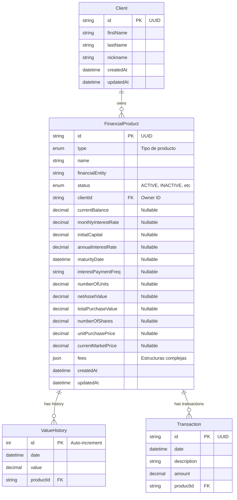

# Diseño de Base de Datos - MyFintonic

## 1. Introducción
Este documento detalla la estructura de la base de datos relacional (MySQL 8) utilizada para la persistencia de los productos financieros. El diseño prioriza la **escalabilidad** de los datos históricos y la **flexibilidad** en la definición de productos mediante el uso de características modernas de SQL.

## 2. Diagrama Entidad-Relación (ERD)

## 3. Estrategia de Diseño

### 3.1. Herencia en una Sola Tabla (Single Table Inheritance)
Para la entidad principal `FinancialProduct`, hemos optado por una estrategia de **Single Table Inheritance**.
*   **¿Qué es?**: Todos los tipos de productos (Cuentas, Fondos, Acciones, Depósitos) se almacenan en una única tabla física.
*   **¿Por qué?**:
    *   **Rendimiento en Dashboard**: La consulta más frecuente es "obtener todos los activos de un usuario para calcular su patrimonio". Con esta estrategia, esto es un simple `SELECT * FROM FinancialProduct WHERE clientId = ?`, evitando múltiples `JOINs` costosos.
    *   **Simplicidad**: Facilita la paginación y el ordenamiento global de productos.
*   **Implementación**: Los campos específicos de cada producto (ej. `numberOfShares` para acciones) son columnas `NULLABLE`. Si el producto es una Cuenta Corriente, `numberOfShares` será `NULL`.

### 3.2. Uso de JSON para Estructuras Flexibles
El campo `fees` se define como tipo `JSON` nativo de MySQL 8.
*   **Motivo**: Las comisiones varían drásticamente entre productos (Fondos tienen apertura/cierre, Acciones tienen compra/venta).
*   **Ventaja**: Evita crear múltiples tablas de "Comisiones" o llenar la tabla principal de columnas que casi siempre estarían vacías. MySQL 8 permite indexar y buscar dentro de este JSON si fuera necesario.

### 3.3. Separación de Históricos y Transacciones
A diferencia de los atributos del producto, el historial de valor y las transacciones bancarias crecen indefinidamente.
*   **Tablas Separadas (`ValueHistory`, `Transaction`)**: Se han extraído a tablas propias con relaciones 1:N.
*   **Escalabilidad**: Esto mantiene la tabla `FinancialProduct` ligera y rápida, mientras que las tablas históricas pueden crecer a millones de registros sin afectar el rendimiento de la carga inicial del dashboard.

## 4. Diccionario de Datos

### Tabla `Client`
| Campo | Tipo | Descripción |
|-------|------|-------------|
| `id` | VARCHAR(191) | Identificador único (UUID). Clave primaria. |
| `firstName` | VARCHAR(191) | Nombre del cliente. |
| `lastName` | VARCHAR(191) | Apellidos del cliente. |
| `nickname` | VARCHAR(191) | Apodo o nombre de usuario para mostrar. |

### Tabla `FinancialProduct`
| Campo | Tipo | Descripción |
|-------|------|-------------|
| `id` | VARCHAR(191) | Identificador único (UUID). Clave primaria. |
| `type` | ENUM | Tipo de producto: `CURRENT_ACCOUNT`, `SAVINGS_ACCOUNT`, `FIXED_TERM_DEPOSIT`, `INVESTMENT_FUND`, `STOCKS`. |
| `status` | ENUM | Estado del producto: `ACTIVE`, `INACTIVE`, `PAUSED`, `EXPIRED`. |
| `clientId` | VARCHAR(191) | ID del usuario propietario del producto. Indexado para búsquedas rápidas. |
| `fees` | JSON | Objeto JSON con las comisiones. Ej: `{"maintenance": 10.0}`. |

### Tabla `ValueHistory`
Almacena la "foto" del valor total del producto en un momento dado. Útil para gráficas de patrimonio.
| Campo | Tipo | Descripción |
|-------|------|-------------|
| `date` | DATETIME | Fecha y hora del registro del valor. |
| `value` | DECIMAL(15, 2) | Valor monetario total del producto en esa fecha. |

### Tabla `Transaction`
Almacena movimientos específicos (ingresos, gastos) asociados principalmente a cuentas bancarias.
| Campo | Tipo | Descripción |
|-------|------|-------------|
| `amount` | DECIMAL(15, 2) | Cantidad del movimiento. Positivo o negativo. |
| `description` | VARCHAR(191) | Concepto del movimiento. |

## 5. Notas sobre Tipos de Datos
*   **DECIMAL vs FLOAT**: Se utiliza `DECIMAL` para todos los campos monetarios para evitar errores de redondeo de punto flotante inherentes a los tipos `FLOAT` o `DOUBLE`.
*   **UUID**: Se utilizan strings UUID para los IDs públicos para evitar enumeración de recursos (seguridad por oscuridad) y facilitar la generación de IDs desde el cliente o aplicación sin depender de la BD.